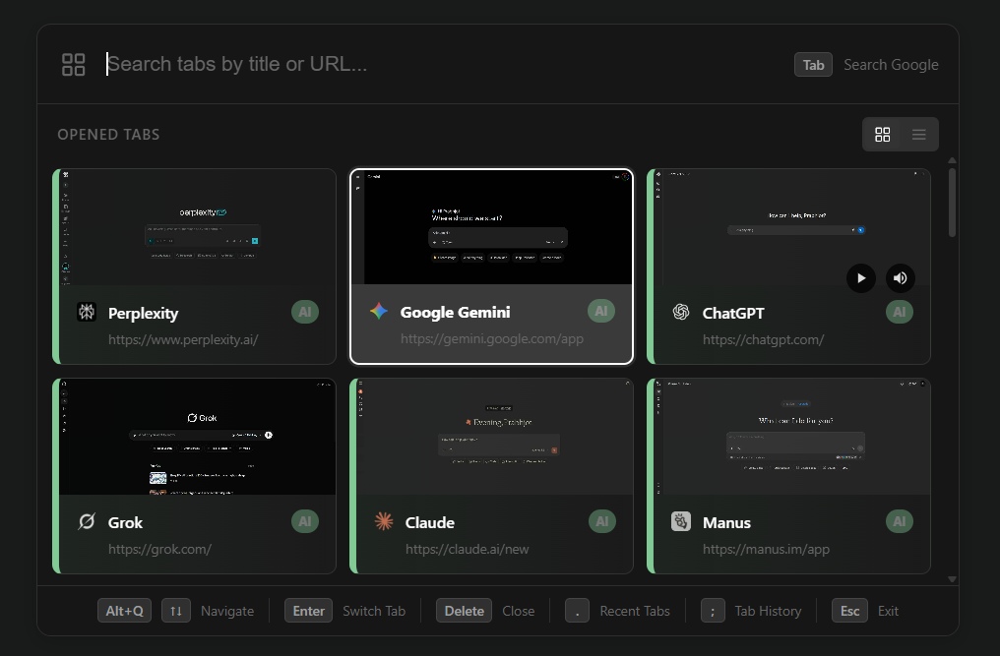

#  Tab Flow




**A professional, high-performance Tab Flow for power users.**
Replace the default browser tab cycle with a beautiful, Mac-like "Mission Control" overlay. Visualize your tabs, search instantly, and navigate with speed.

---

## ✨ Features

### 🎨 Stunning Visual Interface

- **Material Design 3**: Modern, polished overlay following Material Design 3 principles with glassmorphism effects.
- **Live Previews**: High-resolution thumbnail previews of all your open tabs.
- **Theming**: Automatically adapts to **Light** and **Dark** system themes.
- **Audio Indicators**: See which tabs are playing audio at a glance with mute/unmute controls.
- **Consistent Styling**: Uses Shadow DOM to ensure the UI looks perfect on every website, regardless of the host page's styles.

### 📂 Tab Groups Support

- **Visual Group Headers**: Chrome Tab Groups are displayed with collapsible header cards showing the group name and color.
- **Collapse/Expand Groups**: Press `Enter` on a group header to toggle its collapsed state, or click the toggle button.
- **Group Color Indicators**: Each group is highlighted with its assigned color for quick visual identification.
- **Smart Grouping**: Tabs are automatically organized under their respective group headers.

### 🚀 High-Performance Navigation

- **Instant Access**: Opens in **<100ms** thanks to smart pre-caching and service worker optimization.
- **Fuzzy Search**: Rapidly find tabs by title or URL. Just start typing.
- **Smart Sorting**: Tabs are automatically sorted by **Recency**, so your last-used tab is always just one click away.
- **Input Isolation**: Advanced event handling ensures your keystrokes stay within the Flow, preventing accidental input on the underlying page.
- **Virtual Scrolling**: Handles 50+ tabs with smooth 60fps animations.

### ⌨️ Power User Shortcuts

- **Tab History**: Navigate back/forward in a specific tab's history directly from the Flow using `,`.
- **Restore Closed Tabs**: Quickly find and restore recently closed tabs with `.`.
- **Web Search**: Start a web search directly from the Flow with `?`.
- **Keyboard First**: Fully navigable via keyboard, but mouse-friendly too.

---

## ⌨️ Keyboard Shortcuts

| Key                            | Action                                         |
| :----------------------------- | :--------------------------------------------- |
| **`Alt` + `Q`**                | **Open Flow** (Customizable to `Ctrl+Tab`)     |
| **`↑`** / **`↓`**              | Navigate between tabs                          |
| **`Enter`**                    | Switch to selected tab / Toggle group collapse |
| **`Delete`** / **`Backspace`** | Close selected tab                             |
| **`,`**                        | View Tab History (Back/Forward navigation)     |
| **`.`**                        | View Recently Closed Tabs                      |
| **`?`** (Shift + /)            | Web Search                                     |
| **`Esc`**                      | Close Flow                                     |

> **Pro Tip:** You can map this extension to `Ctrl+Tab` in `chrome://extensions/shortcuts` for a native replacement feel.

---

## 🛠️ Installation

### Developer Mode (Current Method)

1. **Clone the repository**:
   ```bash
   git clone https://github.com/prabhjot0109/tab_flow.git
   cd tab_flow
   ```
2. **Install & Build**:
   ```bash
   bun install
   bun run build
   ```
3. **Open Chrome Extensions**:
   - Go to `chrome://extensions/`
   - Toggle **Developer mode** in the top right.
4. **Load Unpacked**:
   - Click **"Load unpacked"**.
   - Select the `dist` directory created by the build.
5. **Setup**:
   - The extension is now active! Press `Alt + Q` to try it out.

---

## 🔧 Technical Architecture

Built with modern **Manifest V3** standards for security and performance.

- **Build System**: Powered by **Vite** and **Bun** for ultra-fast builds and modular development.
- **TypeScript**: Fully typed codebase for better maintainability and developer experience.
- **Modular Architecture**: Codebase split into specialized modules:
  - `content/ui/` - Rendering and overlay management
  - `content/input/` - Keyboard and focus handling
  - `content/actions.ts` - Core actions (switch, close, mute, group operations)
  - `content/state.ts` - Centralized state management
  - `background/` - Service worker for tab management and screenshotting
- **Shadow DOM Isolation**: Completely isolates extension styles from the host page, preventing layout conflicts.
- **Service Worker**: Manages tab state, captures screenshots, and handles background operations.
- **LRU Cache**: Custom Least Recently Used cache with **IndexedDB persistence** for efficient screenshot storage (<50MB memory footprint).
- **Virtual Scrolling**: Optimized rendering for 50+ tabs with smooth 60fps animations.

---

## 🗺️ Roadmap & Improvements

- [x] ~~**Tab Groups**: Visual indicators and filtering for Chrome Tab Groups.~~ ✅ **Implemented!**
- [ ] **Cloud Sync**: Sync your preferences across devices.
- [ ] **Multi-Window**: Enhanced support for managing tabs across multiple windows.
- [ ] **Stats Dashboard**: Visualize your browsing habits.
- [ ] **Custom Themes**: User-defined color schemes and styles.

---

## 🤝 Contributing

Contributions are welcome! Please follow these steps:

1. Fork the project.
2. Create your feature branch (`git checkout -b feature/AmazingFeature`).
3. Commit your changes (`git commit -m 'Add some AmazingFeature'`).
4. Push to the branch (`git push origin feature/AmazingFeature`).
5. Open a Pull Request.

---

## 📝 Changelog

### v1.1.0

- ✨ **Tab Groups Support**: Full Chrome Tab Groups integration with collapsible group headers
- 🎨 **Material Design 3 UI**: Improved visual design with glassmorphism effects
- 🔒 **Enhanced Input Isolation**: Better keystroke handling to prevent input leakage to host pages
- 🐛 **Stability Improvements**: Fixed flickering issues and improved overlay lifecycle management
- ⚡ **Shadow DOM CSS**: More robust styling that works consistently across all websites

### v1.0.0

- Initial release with core tab switching functionality
- Tab preview thumbnails
- Fuzzy search
- Tab history navigation
- Recently closed tabs restoration
- Web search integration

---

**Made with ❤️ for productivity enthusiasts.**
